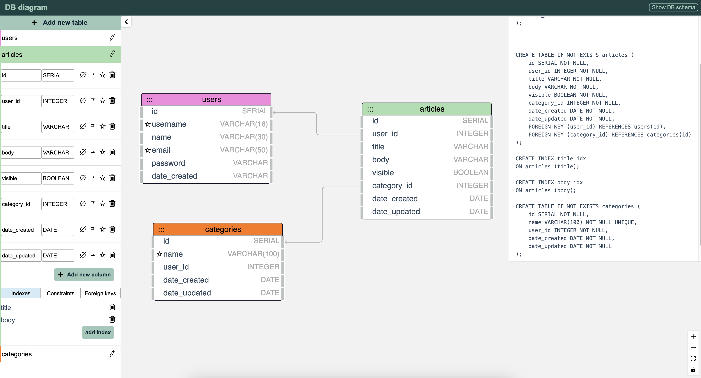

# DB Diagrams

A quick and effective way to understand the structure of a database is by examining its [Entity-Relationship (ER) Diagram](https://en.wikipedia.org/wiki/Entity%E2%80%93relationship_model). I use [DBeaver](https://dbeaver.io/) and I find this feature, within it, very useful. 

When designing a database, being able to visualize its structure makes the process a lot easier.

## Screenshot of DB Diagram UI

